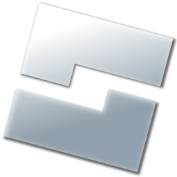

<div align="center">
  

# IngameStudio-roblox
A project that recreates part of Roblox Studio within the Roblox client, while emulating plugin functionality.
</div>

## About

This project consists of two main components:

1. **[IngameStudio](src)**: Implementation for UI elements, using [React Lua](https://github.com/jsdotlua/react-lua) and  [StudioComponents](https://github.com/sircfenner/StudioComponents/tree/main).
2. **[PluginProxy](src/PluginProxy/)**: Implements Studio-specific services, classes, functions and enums required for plugins.

Additionally, this repo includes `CreateStudioTextureAtlas.py`, a Python script for creating icon atlases, which combine the icons from the `studio_svg_textures` folder found in your Roblox installation. This script outputs multiple images and .txt files which are then used in the [icons module](src/PluginProxy/Icons/init.luau) for loading Studio icons.

> [!IMPORTANT]
> Roblox Studio plugins are not directly compatible with **PluginProxy**. Most classes and services need to be replaced with custom ones from the PluginProxy module. A separate repo, `PluginProxy-Transpiler-roblox`, automates this conversion process, though some manual edits may be required.

## Installation

1. Download the latest `IngameStudio.rbxm` module from the releases tab.
2. Drop it in an easily accessible location, such as ReplicatedStorage.

For usage examples, download the latest test place `IngameStudio Testing.rbxl` from the releases tab. The implementation can be found in StarterPlayerScripts.

## Development setup

### Prerequisites
* [**Git**](https://git-scm.com/download/win) *(required for Windows users)*
* [**Aftman** - a tool manager](https://github.com/LPGhatguy/aftman/releases/latest)
### Configuring the project
   
1. Clone the repository:
    ```bash
    git clone 'https://github.com/HintSystem/IngameStudio-roblox.git'
    ```
   
2. Install project tools using *Aftman*:
   1. Go to the cloned repo's directory via your terminal or by opening it in Visual Studio Code and creating a new terminal there
   2. If *Aftman* was installed correctly you should be able to run:
    ```bash
    aftman install
    ```
    This will install the *Rojo* and *Wally* CLI tools

3. Install project packages with *Wally* by running this in the same directory:
    ```bash
    wally install
    ```

> [!WARNING]
> Wally doesn't export types from packages correctly, which will produce type errors in code. If this bothers you, convert the packages using [Wally Package Types Fixer](https://github.com/JohnnyMorganz/wally-package-types)

### Building
> [!TIP]
> You can skip building by installing the [Rojo Visual Studio Code extension](#visual-studio-code-recommendations) and build/serve the project with the extension instead


To build the place from scratch:

```bash
rojo build -o "Test-Place.rbxl"
```

To serve the project:

1. Open `Test-Place.rbxl` in Roblox Studio with the [Rojo plugin](https://create.roblox.com/store/asset/13916111004/) installed.
2. Start the Rojo server:
```bash
rojo serve
```
3. Ensure the Rojo plugin in Roblox Studio shows a successful connection.

Now any changes you make in Visual Studio Code will update in Roblox Studio automatically.


For more help, check out [the Rojo documentation](https://rojo.space/docs).

## Recommended VS Code Extensions

- [Rojo - Roblox Studio Sync](https://marketplace.visualstudio.com/items?itemName=evaera.vscode-rojo): Easily build and serve the project to studio without using commands
- [Luau Language Server](https://marketplace.visualstudio.com/items?itemName=JohnnyMorganz.luau-lsp): Luau autocomplete, typechecking
- [vscode-icons](https://marketplace.visualstudio.com/items?itemName=vscode-icons-team.vscode-icons): Icons that make it easier to find what you're looking for in the explorer tab
- [Even Better TOML](https://marketplace.visualstudio.com/items?itemName=tamasfe.even-better-toml): For edting wally.toml and aftman.toml files